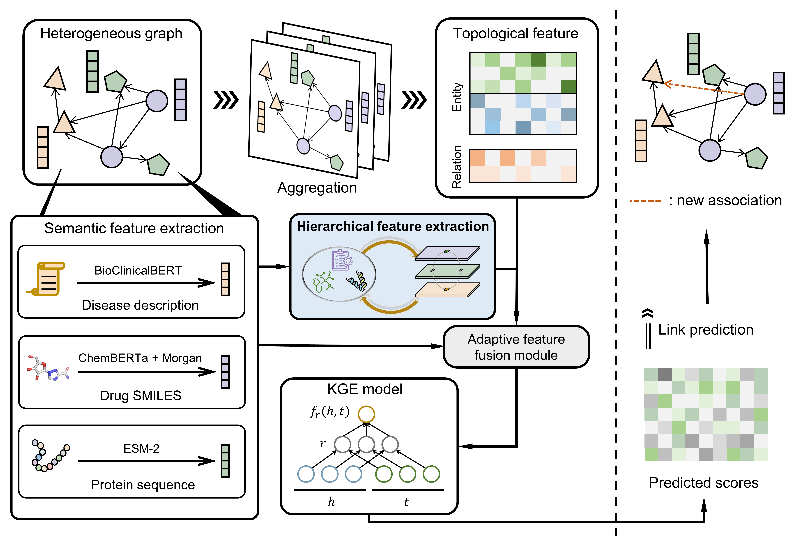

# BRIGHT: A Knowledge Graph Reasoning Framework for Infectious Disease Drug Discovery

[](https://www.python.org)
[](https://pytorch.org)
[](https://neo4j.com)
[](./LICENSE)



## 🌍 Introduction
**BRIGHT** (Biomedical Reasoning with InteGrated Hierarchical represenTations) is a novel reasoning framework designed to accelerate infectious disease drug discovery using the Infectious Disease Knowledge Graph (IDKG).

Facing the global challenge of emerging infectious diseases and antimicrobial resistance, BRIGHT integrates heterogeneous biological data and applies adaptive graph reasoning to discover potential associations, enabling drug repositioning and target discovery.

## 🧠 Infectious Disease Knowledge Graph (IDKG)
**IDKG** is a **comprehensive Infectious Disease Knowledge Graph** designed to integrate diverse biomedical data sources into a unified framework. It aims to facilitate advanced research and applications in infectious disease understanding, treatment, and prevention.


## ⚙️ Framework Overview
**BRIGHT** leverages IDKG as the foundation for a multi-level reasoning pipeline integrating semantic, topological, and hierarchical information. The framework consists of the following key components: 
- Semantic feature extraction
- Hierarchical feature extraction 
- Adaptive feature fusion

## 🧩 Repository Structure
```
BRIGHT/
├── src/
│   ├── model/                   # Model definitions and neural layers
│   └── utils/                   # Utility functions
├── scripts/                     # Utility scripts
├── data/                        # Data directory
├── config/                      # YAML configuration files
└── requirements.txt             # Dependencies
```

## 🚀 Quick Start

```bash
# Clone the repository
git clone git@github.com:henryFan128/BRIGHT.git
cd BRIGHT

# Install dependencies
pip install -r requirements.txt

# Train the model
python scripts/train.py --config config/train.yaml

# Inference & Link prediction
python scripts/inference.py --config config/inference.yaml
```


